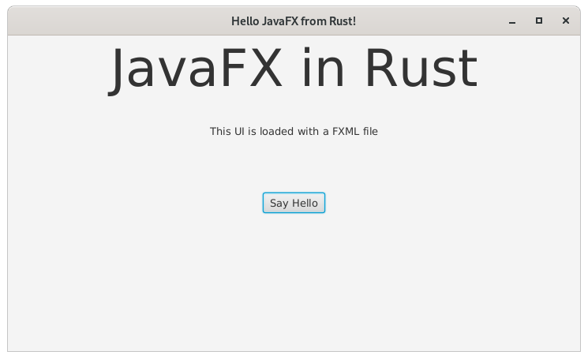

# j4rs-showcase

Showcase for a Rust application that creates and uses a JavaFX User Interface.

## Prerequisites

* Java 11 is installed
* Rust and cargo are installed

## Execution

```bash
cargo run
```

## Execution output

Click the button three times and then press the close button of the JavaFX window.




